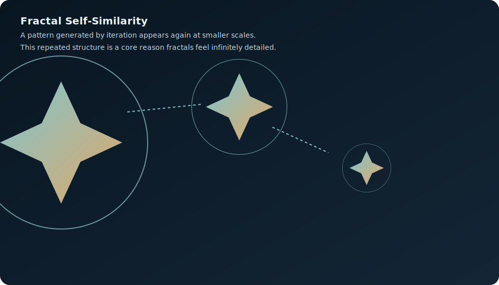
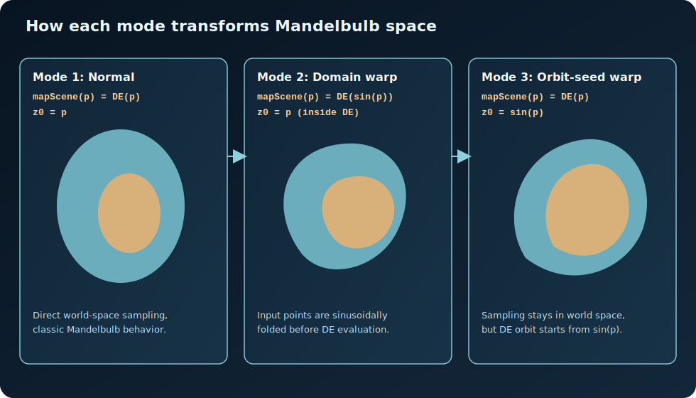

# Mandelbulb Explorer

A full-screen WebGL2 Mandelbulb renderer with interactive camera movement, runtime rendering controls, mobile touch controls, and worker-based screenshots.



## What this project is

This app renders a **3D Mandelbulb fractal** in real time.

- `bufferA.glsl` manages persistent camera state (position, yaw, pitch, move step, FOV).
- `mainImage.glsl` raymarches the fractal and shades the scene.
- `main.js` adapts Shadertoy-style passes to a browser WebGL2 pipeline.
- `screenshot-worker.js` renders screenshots in a worker thread so the main UI stays responsive.

## Quick start

1. Install dependencies:

```bash
npm install
```

2. Run tests:

```bash
npm test
```

3. Start the app server (required for checkout APIs):

```bash
npm start
```

4. Open:

```text
http://localhost:3000
```

## Monetization (Hybrid)

This project includes a one-time premium unlock plus non-intrusive ads.

- Free users: watermark on screenshot export + small bottom ad slot.
- Premium users: no watermark, premium screenshot presets, ads hidden.
- Payment flow: Stripe Checkout with server-side verification and signed unlock token.

### Environment setup

Copy `.env.example` to `.env`, then set real keys.

```bash
cp .env.example .env
```

`server.js` loads `.env` automatically at startup, so `npm start` is enough once variables are set.

### Deploying on Vercel

This repo is Vercel-ready using `api/*.js` serverless functions.

1. Import the repository into Vercel.
2. Set environment variables in Vercel Project Settings.
3. For **Preview** environment, use Stripe **test** keys and test price.
4. For **Production** environment, use Stripe **live** keys and live price.
5. Add Stripe webhook endpoints:
   - Preview: `https://<preview-domain>/api/stripe-webhook`
   - Production: `https://<your-domain>/api/stripe-webhook`

Recommended Vercel env separation:

- Preview:
  - `STRIPE_SECRET_KEY=sk_test_...`
  - `STRIPE_WEBHOOK_SECRET=whsec_...` (from preview endpoint)
  - `STRIPE_PRICE_ID=price_...` (test mode)
- Production:
  - `STRIPE_SECRET_KEY=sk_live_...`
  - `STRIPE_WEBHOOK_SECRET=whsec_...` (live endpoint)
  - `STRIPE_PRICE_ID=price_...` (live mode)

### Security controls in server

- Helmet security headers + CSP
- Stripe webhook signature verification
- Signed unlock tokens (`HS256`)
- Simple API rate limiting
- Strict same-origin API usage

### Security controls in Vercel API mode

- Shared request guards in `lib/http.js` (method + rate limit + body limits)
- Stripe signature verification in `api/stripe-webhook.js`
- Signed unlock JWT generation and validation via `lib/monetization.js`
- CSP and baseline response security headers in `vercel.json`

## Alternative static serving (render-only)

If you only want local rendering without checkout APIs, a static server still works:

```bash
python3 -m http.server
```

Open:

```text
http://localhost:8000
```

## Controls

### Desktop

- Move: `W A S D`
- Vertical move: `E` (up), `Q` (down)
- Look: Arrow keys
- Sprint: `Shift`
- Move step: `Z` / `X`
- FOV in camera state: `-` / `+`

### Mobile

- Left pad: movement
- Right pad: turn
- Middle buttons: up/down
- Right vertical slider: FOV override

## Render modes and math-space meaning

The app has three Mandelbulb modes that modify where distance-estimation math is evaluated.



### Mode 1 - Normal space

- `mapScene(p) = mandelbulbDE(p)`
- DE iteration starts with `z = p`
- Interpretation: classic Mandelbulb distance field in world space.

### Mode 2 - Domain-warped scene sampling

- `mapScene(p) = mandelbulbDE(sin(p))`
- DE iteration still starts with `z = p` *inside* `mandelbulbDE` after receiving the warped point.
- Interpretation: sample location is warped by `sin` before distance estimation, creating periodic folds in space.

### Mode 3 - Warped DE orbit seed

- `mapScene(p) = mandelbulbDE(p)`
- Inside DE: `z` starts at `sin(p)` instead of `p`
- Interpretation: world-space sampling stays direct, but the iterative orbit's initial condition is warped.

In short:

- Mode 2 warps the **input domain** before entering DE.
- Mode 3 warps the **initial DE state** while keeping domain sampling unwarped.

## What is a fractal?

A **fractal** is a geometric structure with detailed patterns that can persist across scales.

Key ideas:

- **Self-similarity**: zoomed regions can resemble larger structure.
- **Recursive/iterative generation**: repeated transformation creates complexity.
- **Fractional detail dimension**: fractals often occupy complexity between standard integer dimensions.

In rendering terms, fractals provide rich geometry from compact formulas.

## What is a Mandelbulb?

The Mandelbulb is a 3D fractal inspired by the 2D Mandelbrot set.

- The Mandelbrot set iterates complex numbers in 2D.
- The Mandelbulb adapts related iterative behavior to 3D vectors using spherical-like transforms and exponentiation.
- This project uses a **distance estimator (DE)** so the shape can be raymarched efficiently.

Simplified DE process:

1. Start with a point `p` and a current orbit value `z`.
2. Convert to angular form (`theta`, `phi`) and radius `r`.
3. Apply power transform and accumulate derivative term `dr`.
4. Iterate until escape or iteration cap.
5. Return estimated signed distance-like value for raymarch stepping.

## Architecture

### Two-pass pipeline

- **Pass A (`bufferA.glsl`)**
  - Updates camera state.
  - Reads keyboard texture (`iChannel1`) and previous state (`iChannel0`).
  - Writes to a 2x1 float texture.

- **Main pass (`mainImage.glsl`)**
  - Reads camera state from pass A.
  - Raymarches Mandelbulb DE.
  - Applies lighting, shadows/AO (quality-dependent), and color grading.

### Input model

- Keyboard input maps to a 256x1 texture (Shadertoy keyboard emulation).
- Mobile touch controls map touch actions into equivalent keycodes.

### Screenshot model

- Screenshot button starts a worker render.
- Worker compiles the same fragment source and renders the current view/state.
- Generated PNG is downloaded when rendering completes.

## Performance notes

- Mobile defaults intentionally reduce workload (resolution scale, max steps, reduced DE iterations, lower power shading).
- Screenshot now follows **current active settings** to avoid GPU crashes on weaker devices.

## Testing

Current automated tests are in `tests/webapp.test.cjs` and cover:

- required files and core UI wiring
- shader-mode and uniform contract checks
- worker screenshot wiring
- key control references from `bufferA.glsl`

Run with:

```bash
npm test
```
